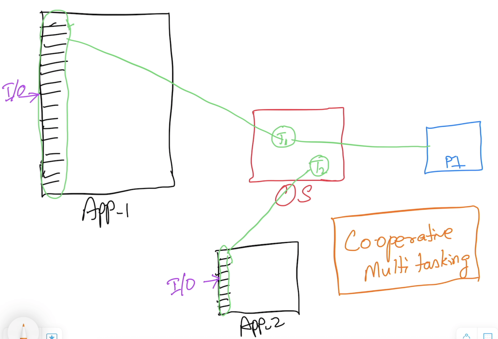
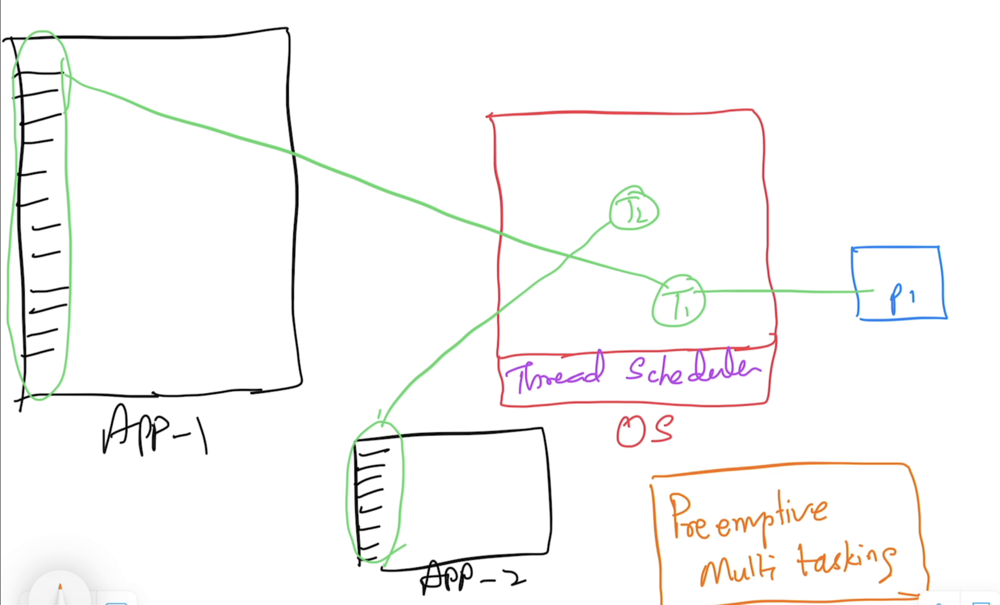
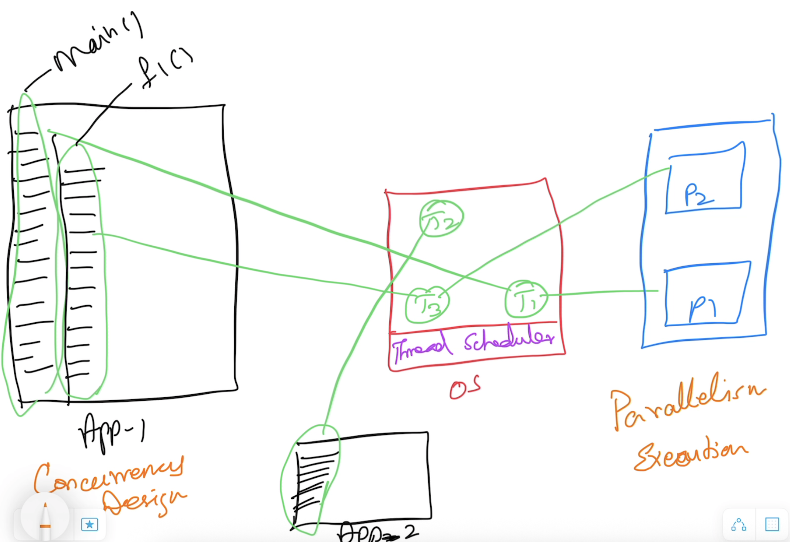
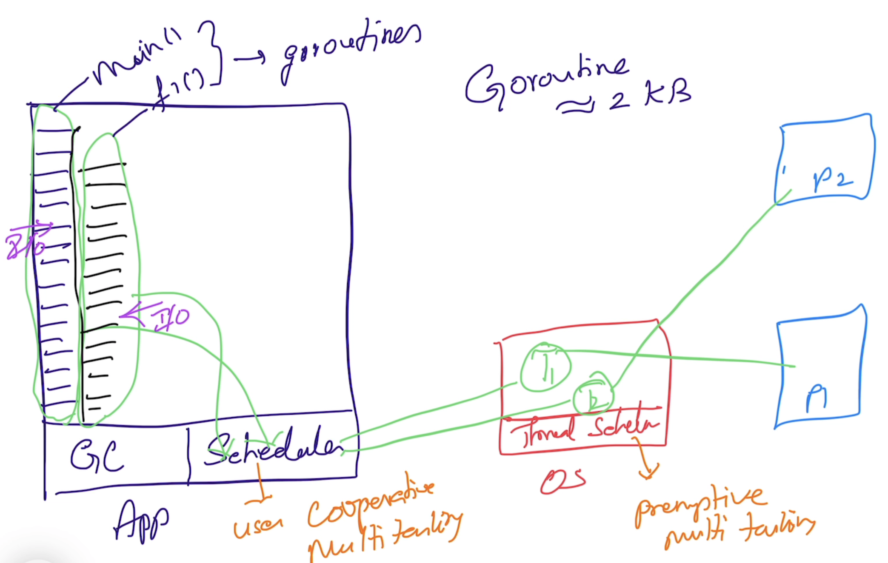

# Advanced Go

## Magesh Kuppan
- tkmagesh77@gmail.com

## Schedule
| What | When |
| ----- | ---- |
| Commence | 9:00 AM |
| Tea Break | 10:40 AM (20 mins) |
| Lunch Break | 12:30 PM (1 hour) |
| Tea Break | 3:00 PM (20 mins) |
| Wind up | 5:00 PM |

## Methodology
- No powerpoint
- Code & Discuss
- Inform before you leave the class

## Software Requirements
- Go Tools (https://go.dev/dl)
- Visual Studio Code (https://code.visualstudio.com)
- Docker Desktop
- Minikube

## Pre-requisites
- Data Types
- Language constructs
    - var, const, iota, if else, switch case 
- Functions
    - Variadic functions
    - Anonymous functions
    - Deferred functions
    - Higher Order functions
        - Functions as arguments
        - Functions as return values
- OO programming in Go
    - structs
        - methods
        - struct composition
    - interfaces
- Error handling
- Panic & Recovery
- Modules & Packages

## Training Repository
- https://github.com/tkmagesh/cisco-advgo-apr-2025

## Concurrency
- Design of an application in such a way that the application has more than one execution path

### Cooperative Multitasking

---
### Preemptive Multitasking

---
### Concurrency Vs Parallelism

---
### Go Concurrency Model


#### Language Support for concurrency
- "go", "range", "select-case" keywords
- "chan" data type
- "<-" operator

#### Standard Library Support
- "sync" package
- "sync/atomic" package

#### sync.WaitGroup
- semaphore based counter
- Has the ability to block the execution of a function until the counter becomes 0

#### Detecting data races
```shell
go run -race <filename.go>
```
```shell
go build -race <filename.go>
```