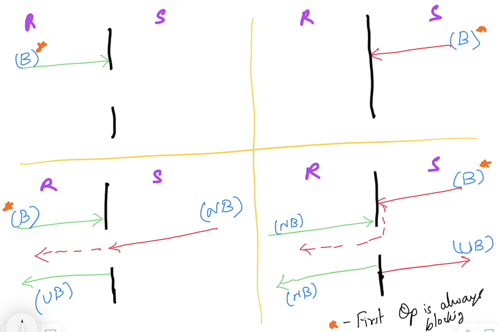

# Advanced Go

## Magesh Kuppan
- tkmagesh77@gmail.com

## Schedule
| What | When |
| ----- | ---- |
| Commence | 9:00 AM |
| Tea Break | 10:40 AM (20 mins) |
| Lunch Break | 12:30 PM (1 hour) |
| Tea Break | 3:00 PM (20 mins) |
| Wind up | 5:00 PM |

## Methodology
- No powerpoint
- Code & Discuss
- Inform before you leave the class

## Software Requirements
- Go Tools (https://go.dev/dl)
- Visual Studio Code (https://code.visualstudio.com)
- Docker Desktop
- Minikube

## Pre-requisites
- Data Types
- Language constructs
    - var, const, iota, if else, switch case 
- Functions
    - Variadic functions
    - Anonymous functions
    - Deferred functions
    - Higher Order functions
        - Functions as arguments
        - Functions as return values
- OO programming in Go
    - structs
        - methods
        - struct composition
    - interfaces
- Error handling
- Panic & Recovery
- Modules & Packages

## Training Repository
- https://github.com/tkmagesh/cisco-advgo-apr-2025

## Concurrency
- Design of an application in such a way that the application has more than one execution path

### Cooperative Multitasking

---
### Preemptive Multitasking

---
### Concurrency Vs Parallelism

---
### Go Concurrency Model


#### Language Support for concurrency
- "go", "range", "select-case" keywords
- "chan" data type
- "<-" operator

#### Standard Library Support
- "sync" package
- "sync/atomic" package

#### sync.WaitGroup
- semaphore based counter
- Has the ability to block the execution of a function until the counter becomes 0

#### Detecting data races
```shell
go run -race <filename.go>
```
```shell
go build -race <filename.go>
```

#### Channels
##### Creating a channel
```go
var ch chan int
ch = make(chan int)
```
**OR**
```go
var ch chan int = make(chan int)
```
**OR**
```go
var ch = make(chan int)
```
**OR**
```go
ch := make(chan int)
```

##### Channel Operations
Using the channel operator **<-**
###### Send Operation
```go
ch <- 100
```
###### Receive Operation
```go
data := <- ch
```
###### Channel Behavior

---

### Context
- Cancel Propagation
- All context types inherit from interface `context.Context`
- `context.Context`
    - `Done()` - returns a channel that gets unblocked when a cancel signal is received
- Creation
    - Root context
        - `context.Background()`
    - context children
        - `context.WithCancel(parentCtx)`
            - returns a context & cancel function
            - programmatic cancellation
            - invoking the returned `cancel` function will send the "cancellation" signal to all the context children

        - `context.WithTimeout(parentCtx, ...)` [relative time]
        - `context.WithDeadline(parentCtx, ...)` [absolute time]
            - returns a context & cancel function
            - Time based cancellation
            - automatically sends cancellation signal when timeout occurs
            - can also be overriden by invoking the `cancel` function

        - `context.WithValue(parentCtx, ...)`
            - returns a context
            - non-cancellable
            - used for sharing data across context hierarchies

### Database programming
- using standard library (database/sql)
- using sqlx (wrapper for database/sql)
- using sqlc (code generator)

### Http Services
```shell
curl http://localhost:8080/products --header "Content-Type:application/json" --request POST --data '{"id":200,"name":"Stylus", "cost":1000, "units":5}'
```

## GRPC
- Alternative to HTTP based restful services
- Apt for microservices communication
- Uses HTTP/2 for communication
- Communication Patterns
    - Request & Response (1 Req & 1 Res )
    - Server Streaming (1 Req & Stream of Resps)
    - Client Streaming (Stream of reqs & 1 Res)
    - Bidirectional Streaming (Stream of reqs & Stream of resps)
- Protocol Buffers for serialization
    - Allows for sharing the schema well in advance
    - Works well with known clients (microservices)
    - Enables ONLY the data (without any annotation/label) for communication
- Multilanguage support
    - Go
    - .Net
    - JS
    - Java
    - C++
### Steps
    - Define data contracts (protobuf)
    - Define service contract (protobuf)
        - Define operation contracts (protobuf)
    - Generate the Proxy & Stub
    - Implement the service and host it using the Stub
    - Create a client that communicates to the sevice using the Proxy

### Tools Installation 
    1. Protocol Buffers Compiler (protoc tool)
        Windows:
            Download the file, extract and keep in a folder (PATH) accessble through the command line
            https://github.com/protocolbuffers/protobuf/releases/download/v24.4/protoc-24.4-win64.zip
        Mac:
```shell
            brew install protobuf
```
        Verification:
```shell
            protoc --version
```

    2. Go plugins (installed in the GOPATH/bin folder)
```shell
            go install google.golang.org/protobuf/cmd/protoc-gen-go@v1.28
            go install google.golang.org/grpc/cmd/protoc-gen-go-grpc@v1.2
```
        Verification:
            the binaries (protoc-gen-go, protoc-gen-go-grpc) must be present in $GOPATH/bin folder
    
